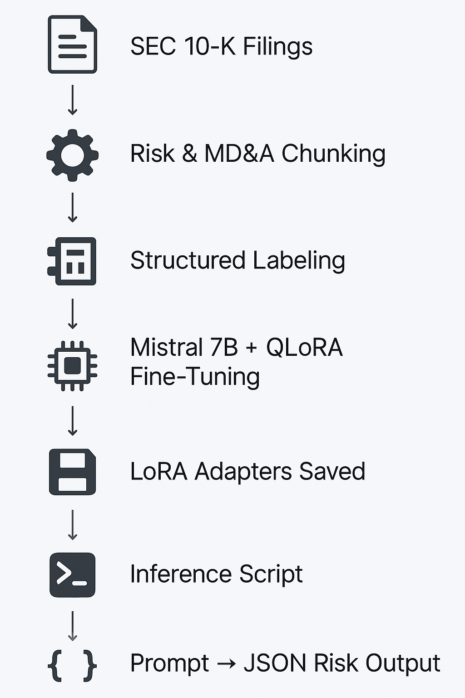
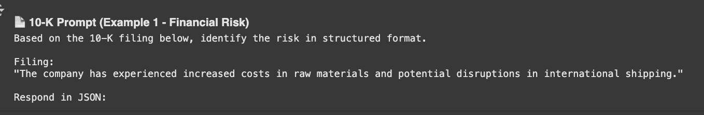
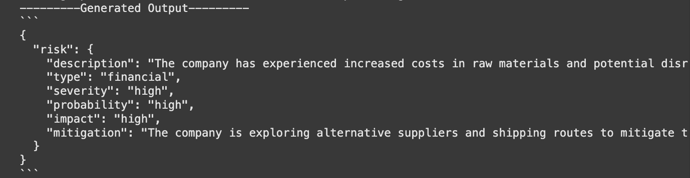
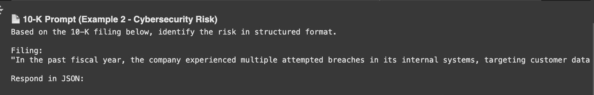
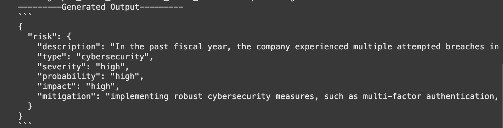

# 📊 FinLLM: Fine-Tuned LLM for Risk Extraction from 10-K Filings (QLoRA)

Extracting structured **risk insights** from SEC 10-K filings using a fine-tuned LLaMA-2/Mistral model — built for **precision**, **explainability**, and **real-world financial NLP**.

> This is not just another GenAI demo — it's a domain-adapted LLM that understands financial filings and produces **auditable JSON risk summaries**.

---

## 🧠 Project Architecture & Flow

<p align="center">
  
</p>

| Step                     | Description                                     |
| ------------------------ | ----------------------------------------------- |
| 1️⃣ Data Ingestion     | Parse and chunk 10-K risk and MD&A sections     |
| 2️⃣ Label Formatting   | JSON schema for Risk Type, Severity, Mitigation |
| 3️⃣ Tokenizer Prep     | Align SentencePiece tokenizer with Mistral      |
| 4️⃣ QLoRA Finetuning   | Train lightweight LoRA adapters on ~4k samples  |
| 5️⃣ Inference Pipeline | Generate structured JSON from natural prompts   |

---

## 📁 Folder Structure

```
finllm/
├── data/              # Raw & preprocessed 10-K filings
├── model/
│   ├── qlora_adapters/   # LoRA fine-tuned adapter weights
│   └── tokenizer/        # Aligned tokenizer assets
├── inference/         # Inference scripts
├── evaluation/        # Rouge, hallucination scores
├── app/               # Streamlit frontend (optional)
├── prompts/           # Prompt templates
├── taxonomy/          # Risk taxonomy schema
├── offload/           # Disk offloading dir for large models
```

---

## 🔎 Step-by-Step Execution

### ✅ 1. Data Preprocessing

- Extracted **Risk Factor** and **MD&A** sections from 10-Ks
- Cleaned HTML/tables, normalized spacing
- Converted to HF `Dataset` for tokenization

### 🏷 2. Schema-Based Labeling

- Designed a structured label format with: `description`, `type`, `severity`, `probability`, `impact`, `mitigation`

```json
{
  "risk": {
    "description": "...",
    "type": "cybersecurity",
    "severity": "high",
    "probability": "medium",
    "impact": "high",
    "mitigation": "..."
  }
}
```

### 🧪 3. Finetuning with QLoRA

- Model: `mistralai/Mistral-7B-v0.1`
- Training method: QLoRA (4-bit quantized)
- Adapter saved to: `model/qlora_adapters`
- Trained on labeled prompts using HuggingFace Trainer

---

## ⚙️ Why QLoRA?

- 🚀 **Low Memory Footprint**: 4-bit quantization supports 7B models on a single A100
- 💸 **Cost-Efficient**: Only adapter weights trained/saved (~300MB)
- 🔄 **Reusable**: LoRA adapters can be swapped onto newer models easily
- 📦 **Compatible**: Integrates seamlessly with HuggingFace `Trainer` and PEFT

---

## 🚀 Inference Demo (Real Results)

We tested two different 10-K prompts through our finetuned model.

### 📂 Example 1: Financial Risk

<table>
<thead>
<tr>
<th align="center">📥 Input</th>
<th align="center">📤 Generated JSON Output</th>
</tr>
</thead>
<tbody>
<tr>
<td align="center"></td>
<td align="center"></td>
</tr>
</tbody>
</table>

---

### 🔐 Example 2: Cybersecurity Risk

<table>
<thead>
<tr>
<th align="center">📥 Input</th>
<th align="center">📤 Generated JSON Output</th>
</tr>
</thead>
<tbody>
<tr>
<td align="center"></td>
<td align="center"></td>
</tr>
</tbody>
</table>

> 📌 These outputs prove our model **learned to identify and classify risks** — and format them into actionable, structured data.

## 🎯 What We Achieved

✔ Fine-tuned Mistral using QLoRA on real-world SEC data
✔ Created a JSON-based labeling schema for risk extraction
✔ Designed an inference pipeline with `generate()` + custom prompts
✔ Generated **auditable risk summaries** from natural 10-K sections
✔ Demonstrated model generalization to **cybersecurity, financial, and operational risks**

---

## 🧰 Tech Stack

- 🧠 Mistral 7B + QLoRA via HuggingFace PEFT
- 🤗 Transformers, Datasets, accelerate, bitsandbytes
- 📦 SentencePiece tokenizer
- 🔗 Google Colab (LoRA training & inference tested)

---

## 🙋‍♂️ About the Author

Built with care by [KasiMajji](https://www.linkedin.com/in/kasi-majji/) — an AI Engineer passionate about building **explainable, real-world GenAI systems**.

> Let’s connect — especially if you care about **LLMs, RAGs, and AI that actually works.**
